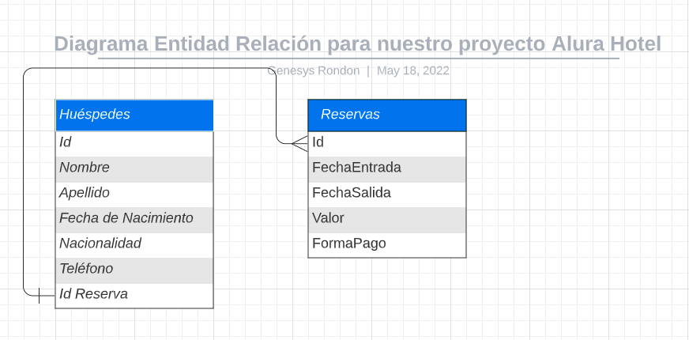

# Hotel Alura (Plataforma de reservas y huespedes)


## Descripción

¡Bienvenido al más reciente desafío del
[Challenge Java](https://www.aluracursos.com/challenges/oracle-one-back-end/hotelalura)!

<p align="center" >
     
</p>

El Hotel Alura conocido por su espectaculares instalaciones y paquetes
promocionales para Desarrolladores de Software está teniendo problemas
para llevar el control de las reservaciones hechas por sus clientes, por
eso solicitan nuestra ayuda para desarrollar un sistema de reserva que
contenga:

1. Sistema de autenticación de usuario para que solo usuarios pertenecientes
al hotel consigan acceder al sistema.

2. Permitir crear, editar y eliminar una reserva para los clientes.

3. Buscar en la base de datos todas las informaciones tanto de los clientes
como de las reservas.

4. Registrar, editar y eliminar datos de los huéspedes.

5. Calcular el valor de la reserva en base a la cantidades de días de la
reserva y a una tasa diaria que puede ser asignada por ti y en la moneda
local de tu país, por ejemplo si tenemos una reserva de 3 dias y el valor
de nuestra diaria son 20$ debemos multiplicar esos 3 dias por el valor de
la diaria, lo que serian 60$, todo esto deberá ser hecho automaticamente y
mostrado al usuario antes de guardar la reserva.

6. Base de datos para almacenar todos los datos pedidos anteriormente.

Ahora te preguntarás ¿Cómo se que datos debo registrar? Para eso el líder
del proyecto puso a disposición un Diagrama de Entidad Relación que usaremos
para crear las tablas en nuestra base de Datos y que está anexado a esta
tarjeta y que también estará como una tarea en nuestro backlog de [Trello](https://trello.com/b/ChK4w5Be/challenge-2-alura).



## Tabla de contenido

- [Estado del proyecto](#estado-del-proyecto)
  - [Menu principal de la aplicacion 🏁](#menu-principal-de-la-aplicacion-)
  - [Ventana de login ⏸️](#ventana-de-login-)
  - [Ventana de menu de usuario 💻](#ventana-de-menú-usuario-)
  - [Ventana registro de reservas 💻](#ventana-registro-de-reservas-)
  - [Ventana de registro de huesped 💻](#ventana-de-registro-de-huésped-)
  - [Sistema de busqueda ⛔️](#sistema-de-búsqueda-)
  - [Editar datos reservas ⛔️](#editar-datos-reservas-)
  - [Editar datos huesped ⛔️](#editar-datos-huésped-)
  - [Eliminar datos reserva ⛔️](#eliminar-datos-reservas-)
  - [Eliminar datos huesped ⛔️](#eliminar-datos-huésped-)
- [Instalacion](#instalación)
- [Uso](#uso)
- [Contribucion](#contribución)
- [Estructura del proyecto](#estructura-del-proyecto)
- [Dependencias](#dependencias)
- [Ejemplos](#ejemplos)
  - [Cursos](#cursos)
  - [Articulos](#artículos)
  - [Alura +](#alura-)
- [Documentacion adicional](#documentación-adicional)
- [Licencia](#licencia)
- [Contacto](#contacto)

## Estado del proyecto

Recuerda que el código fuente con la parte gráfica de nuestro menú principal
al igual que todas las imagenes usadas en el sistema, se encuentran en el
[Repositório Base](https://github.com/alura-challenges/challenge-one-alura-hotel-latam.git)
del proyecto.

### Menu principal de la aplicacion 🏁

El menú principal de nuestra aplicación es nuestra presentación, podemos ver que contiene diferentes elementos:

- Imagen de wallpaper
- Logo del Hotel
- Botón Login que al ser clickado debe llevar a la ventana de iniciar sesión
- Botón salir que debe preguntar al usuario si realmente desea salir de la aplicación.

### Ventana de login ⏸️

Esta ventana debe permitir al usuario ingresar su usuario y contraseña.

Por detrás de la cortina debemos verificar si los datos ingresados son
correctos o incorrectos y notificar al usuario de este estatus, por
ejemplo si los datos son incorrectos debe ser mostrado una mensaje al
usuario diciendo "Usuario y Contraseña inválidos"

Para realizar esta tarea puedes crear usuarios predeterminados a través
del código, que seria una opción más simple, o crear una tabla en tu base
de datos para realizar esta autenticación e inclusive adicionar nuevos
usuários.

### Ventana de Menú Usuario 💻

En esta ventana se presentarán las opciones cuando el usuario autenticado
está dentro del sistema, tienes las siguientes opciones:

- Reservar: Deve llevar a la ventana de Reservas 
- Búsqueda: Deve llevar a la ventana de Sistema de búsqueda. 
- Salir del Sistema: Deve llevar a la ventana de Login

### Ventana Registro de Reservas 💻

La ventana de Reservas debe permitir al usuário registrar los siguientes
datos:

- Día de Entrada 
- Día de Salida 
- Valor de la reserva, que será calculado en base a un valor de diaria fijo
que tú mismo podrás elegir.
- Forma de Pago donde el usuário podrá elegir entre:
  - Tarjeta de crédito 
  - Tarjeta de débito 
  - Dinero en efectivo 
- Botón continuar

Es importante que al momento de guardar nuestros datos sea generado un
número de reserva que será utilizado en la sección de registro de huéspedes
de forma automática ya que será un campo que el usuário no podrá manipular.

Recuerda que debes notificar al usuário tanto para registro satisfactorio
de los datos como si ocurrió algún error.

Te dejamos algunos artículos que pueden ayudarte en la realización de esta actividad:

- [Redondeo y números gigantes: de double a BigDecimal](https://www.aluracursos.com/blog/redondeo-y-numeros-gigantes-de-double-a-bigdecimal)
- [Cómo convertir de String para Date en Java](https://www.aluracursos.com/blog/como-convertir-string-para-date-en-java)

### Ventana de Registro de Huésped 💻

Esta sección tendrá los datos personales de los huéspedes con los
siguientes campos:

- Nombre 
- Apellido 
- Fecha de Nacimiento 
- Nacionalidad 
- Teléfono 
- Número de reserva que fue generada anteriormente.

Recuerda que debes notificar al usuário tanto para registro satisfactorio
de los datos como si ocurrió algún error.

Mostrar como mensaje al usuário el número de reserva.

### Sistema de Búsqueda ⛔️

Esta sección debe permitir al usuario buscar las informaciones que están
dentro de nuestra base de datos.

Existen dos critério de búsqueda:

- Apellido 
- Número de Reserva

Estos datos serán presentado a través de dos tablas, al seleccionar
cualquier registro el usuario podrá, editar o eliminar dicho registro.

### Editar Datos Reservas ⛔️

Si el usuario necesita hacer la edición de alguna información, al hacer
click en el registro que se desea modificar y en el icono de editar debe
conseguir editar los datos y una vez hecha la modificación el usuario
deverá ser notificado de que los cambios fueron guardados o si hubo algún
error.

### Editar Datos Huésped ⛔️

Si el usuario necesita hacer la edición de alguna información, al hacer
click en el registro que se desea modificar y en el icono de editar debe
conseguir editar los datos y una vez hecha la modificación el usuario
deverá ser notificado de que los cambios fueron guardados o si hubo algún
error.

### Eliminar Datos Reservas ⛔️

Si el usuario necesita eliminar algún registro, al hacer click en el
registro que se desea eliminar y en el icono de eliminar debe conseguir
eliminar los datos y una vez hecha la eliminación el usuario deverá ser
notificado de que los cambios fueron hechos o si hubo algún error, además
de actualizar los datos de la tabla y mostrarlo en pantalla

Tip: Para actualizar la base de datos después de eliminar algún registro
tal vez podamos llamar nuevamente a nuestro método Buscar.

### Eliminar Datos Huésped ⛔️

Si el usuario necesita eliminar algún registro, al hacer click en el
registro que se desea eliminar y en el icono de eliminar debe conseguir
eliminar los datos y una vez hecha la eliminación el usuario deverá ser
notificado de que los cambios fueron hechos o si hubo algún error, además
de actualizar los datos de la tabla y mostrarlo en pantalla

**Tip**: Para actualizar la base de datos después de eliminar algún registro
tal vez podamos llamar nuevamente a nuestro método Buscar.

## Instalación
Instrucciones paso a paso para instalar y configurar el proyecto en un entorno local o en la nube.

### ⚠️ Importante! ⚠️
- ☕ Use Java versión 8 o superior para compatibilidad.
- 📝 Recomendamos usar el editor de Eclipse para compatibilidad con la Interfaz Gráfica.
- 🎨 La interfaz contiene dos métodos importantes:
  - setResizable(false): determina el tamaño de la ventana, y a través del parámetro false, la pantalla no se puede maximizar;
  - setLocationRelativeTo(null): determina la ubicación de la ventana, y a través del parámetro null la mantiene centrada en la pantalla.

## Uso
Explica cómo utilizar el proyecto, cómo ejecutarlo y cómo interactuar con él.

### 🚧 Proyecto

Al clonar o descargar el proyecto base y tener instalado el JCalendar, tendrás esta presentación al ejecutar el proyecto en Eclipse:

<p align="center" >
     
</p>

### ⚠️ Descargué el proyecto pero los caracteres especiales no funcionan:

Si tu proyecto tiene errores como los de la imagen, siga los pasos a continuación:

<p align="center" >
     
</p>

Ve a <em>Window</em> y haz clic en <em>Preferences</em>.

<p align="center" >
     
</p>

Luego haz clic en <em>General</em> y en <em>Workspace</em>. Si tu <em>Text File Enconding</em> no está con el <strong>Default (UTF-8)</strong>, haz clic en <em>Other</em>, y eliges la opción <strong>UTF-8</strong>, y finaliza haciendo clic <em>Apply and Close</em>.

<p align="center" >
     
</p>

### Creando la base de datos

```sql
CREATE DATABASE hotel;

USE hotel;

CREATE TABLE reservas(
	id INT NOT NULL AUTO_INCREMENT,
    fecha_entrada DATE NOT NULL,
    fecha_salida DATE NOT NULL,
    valor INT NOT NULL,
    forma_pago VARCHAR(45),
    PRIMARY KEY (id));

CREATE TABLE huespedes (
  id INT NOT NULL AUTO_INCREMENT,
  nombre VARCHAR(25) NOT NULL,
  apellido VARCHAR(25) NOT NULL,
  fecha_nacimiento DATE NOT NULL,
  nacionalidad VARCHAR(45) NULL,
  telefono LONG NOT NULL,
  id_reserva INT,
  PRIMARY KEY (id),
  FOREIGN KEY (id_reserva) REFERENCES reservas(id));
```

## Contribución
Si permites contribuciones de la comunidad, proporciona pautas claras para que otros puedan colaborar en el proyecto. Incluye información sobre el proceso de solicitud de extracción (pull request) y las reglas de estilo de código si corresponde.

## Estructura del proyecto
Si el proyecto tiene una estructura de directorios específica, menciona los directorios clave y su propósito.

## Dependencias
Enumera las dependencias externas necesarias para ejecutar el proyecto, incluyendo bibliotecas y frameworks, y cómo instalarlas.

- Java
- Eclipse -> IntelliJ 
- Maven:
  - Biblioteca JCalendar 
  - MySql 
- Plugin WindowBuilder

## Ejemplos

- [Solución del Challenge Hotel Alura parte 1](https://www.youtube.com/watch?v=1luEBNCweG4&ab_channel=AluraLatam)
- [Solución del Challenge ONE Hotel Alura](https://www.youtube.com/watch?v=8y5fqKVfDWU&ab_channel=AluraLatam)

## Documentación adicional

### Cursos
- [Java: Dominando las Collections](https://www.aluracursos.com/curso-online-java-dominando-collections)
- [Introducción a SQL con MySQL: Manipule y consulte datos](https://app.aluracursos.com/course/introduccion-sql-mysql-manipule-consulte-datos)
- [Java y JDBC: Trabajando con una Base de Datos](https://app.aluracursos.com/course/java-jdbc-trabajando-base-datos)

### Artículos
- [Conociendo JDBC](https://www.aluracursos.com/blog/conociendo-el-jdbc)
- [¿Qué es la biblioteca Swing?](https://www.aluracursos.com/blog/biblioteca-swing)
- [Redondeo de números en Java](https://www.aluracursos.com/blog/redondeo-de-numeros-en-java)
- [Redondeo y números gigantes: de double a BigDecimal](https://www.aluracursos.com/blog/redondeo-y-numeros-gigantes-de-double-a-bigdecimal)
- [Cómo convertir de String para Date en Java](https://www.aluracursos.com/blog/como-convertir-string-para-date-en-java)
- [MySQL: desde la descarga e instalación hasta su primera tabla](https://www.aluracursos.com/blog/mysql-desde-la-descarga-e-instalacion-hasta-su-primera-tabla)
- [Interfaces Gráficas con Eclipse WindowBuilder](https://www.aluracursos.com/blog/interfaces-graficas-con-eclipse-windowbuilder?utm_source=gnarus&utm_medium=timeline)
- [¿Qué es la biblioteca Swing?](https://www.aluracursos.com/blog/biblioteca-swing)

### Alura +
- [Simplificando tu código en Java: Conoce los enum](https://www.youtube.com/watch?v=EoPvlE85XAQ&t=43s&ab_channel=AluraLatam)
- [¿Que son anotaciones en java?](https://app.aluracursos.com/extra/alura-mais/que-son-anotaciones-en-java--c230)

## Licencia
Especifica la licencia del proyecto para que los usuarios sepan los términos bajo los cuales pueden utilizarlo.

## Contacto
Proporciona información de contacto, como una dirección de correo electrónico o un enlace a la página de contacto, para que los usuarios puedan comunicarse contigo si tienen preguntas o problemas.